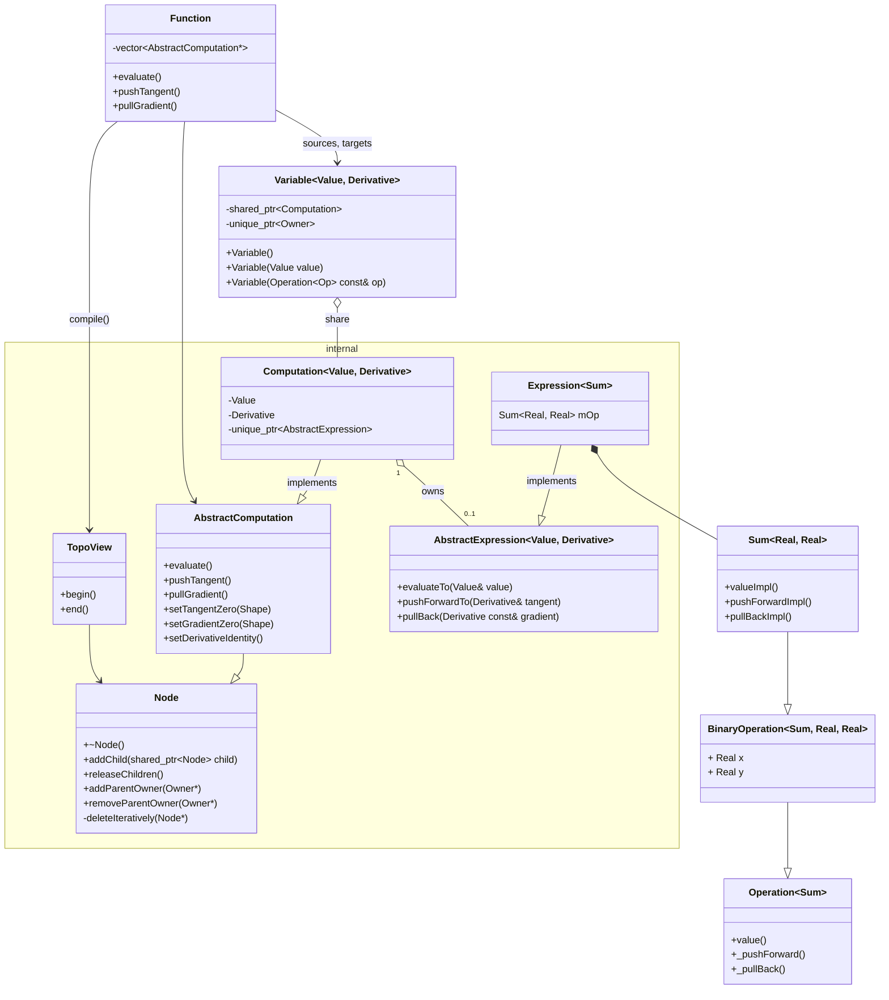

# Class diagram

The class diagram below shows a simplified overview of the main AutoDiff classes involved in the following code.

```cpp
Real x, y;
auto expr = x + y;  // Sum<Real, Real>
Real z = var(expr); // Variable<double, double>
Function f(from(x, y), to(z));
f.evaluate();
```


